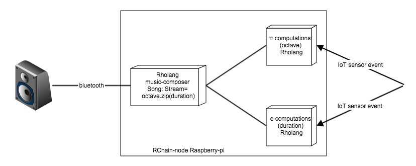

# SpigetOfMusic
compose music from sensor events deployed to Raspberry Pi developed in Rholang

## Getting Started

These instructions will get you a copy of the project up and running on your local machine for development and testing purposes.
TBD

### Prerequisites

What things you need to install the software and how to install them
TBD

```
Give examples
```

## Running the tests

How to run the automated tests for this system
TBD

```
Give an example
```

## Deployment

Add additional notes about how to deploy this on a live system

## Versioning

We use [SemVer](http://semver.org/) for versioning. 

## References
-[Rholang](https://github.com/rchain/rchain/tree/master/rholang)   
